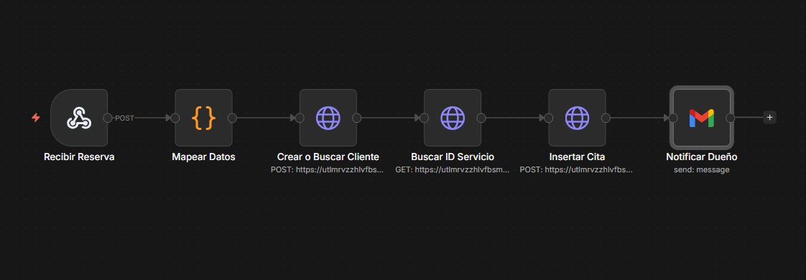
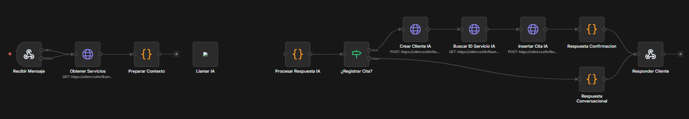
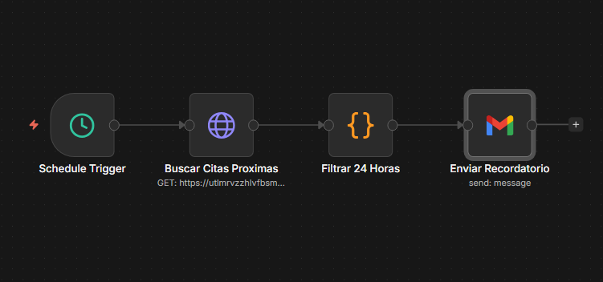
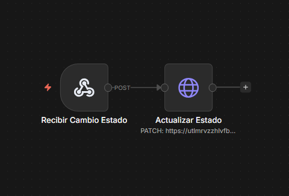

# 💇 AI Booking & Business Automation System

> Sistema inteligente de reservas y automatización de procesos para un salón de belleza utilizando Inteligencia Artificial, n8n e integraciones empresariales.

---

# 📌 Descripción del proyecto

Salon Bella AI Booking System es una solución de automatización diseñada para digitalizar y optimizar el proceso completo de atención al cliente de un salón de belleza.

La plataforma permite gestionar reservas, consultar disponibilidad, registrar clientes, enviar recordatorios automáticos, actualizar el estado de las citas y responder consultas mediante un asistente impulsado por Inteligencia Artificial.

Todo el ecosistema está construido sobre n8n, integrando Supabase, Gemini AI, Gmail y APIs REST para eliminar tareas manuales y mejorar la experiencia del cliente.

---

# 🎯 Problema de negocio

Antes de la automatización, el negocio dependía de procesos manuales para:

- Registrar clientes.
- Agendar citas.
- Consultar disponibilidad.
- Confirmar reservas.
- Enviar recordatorios.
- Actualizar el estado de las citas.
- Responder preguntas frecuentes.

Esto ocasionaba retrasos, errores administrativos y una mala experiencia para los clientes.

---

# ✅ Solución implementada

Se desarrolló un ecosistema de automatización compuesto por múltiples workflows especializados.

La solución permite:

- Registrar automáticamente nuevos clientes.
- Crear reservas en tiempo real.
- Consultar disponibilidad de servicios.
- Gestionar la agenda del salón.
- Actualizar automáticamente el estado de las citas.
- Enviar recordatorios automáticos.
- Responder consultas mediante IA.
- Centralizar toda la información en Supabase.

---

# 🤖 Automatizaciones incluidas

## 📅 Gestión de reservas

- Recepción de solicitudes de reserva.
- Validación de información.
- Búsqueda o creación del cliente.
- Consulta de servicios.
- Registro automático de la cita.
- Confirmación mediante correo electrónico.

---

## 🧠 Asistente con Inteligencia Artificial

El asistente responde automáticamente consultas relacionadas con:

- Servicios.
- Horarios.
- Disponibilidad.
- Precios.
- Información general del negocio.

Utiliza Google Gemini para comprender la intención del usuario y generar respuestas naturales.

---

## ⏰ Recordatorios automáticos

El sistema identifica las citas próximas y envía recordatorios automáticos para disminuir ausencias y mejorar la puntualidad de los clientes.

---

## 🔄 Actualización de estado

Cuando una cita cambia de estado (confirmada, cancelada o completada), el sistema actualiza automáticamente la información en la base de datos.

---

# 🔄 Arquitectura general

```text
Cliente

↓

Formulario / Chat

↓

Webhook (n8n)

↓

Procesamiento

↓

Supabase

↓

Google Gemini

↓

Lógica de negocio

↓

Reserva / Consulta / Recordatorio

↓

Email automático
```

---

# 🏗️ Arquitectura y Workflows

## Arquitectura general del sistema

> El sistema integra una aplicación web desarrollada en Lovable, una base de datos en Supabase, múltiples workflows en n8n y un asistente basado en Google Gemini para automatizar el ciclo completo de reservas, recordatorios y gestión de citas.


---

## 📅 Workflow - Gestión de Reservas

Este workflow recibe las solicitudes provenientes del formulario web, registra o actualiza el cliente en Supabase, crea la cita y notifica automáticamente al administrador.



---

## 🤖 Workflow - Asistente IA

Este workflow implementa un asistente conversacional utilizando Google Gemini. Interpreta la intención del usuario, recopila la información necesaria y registra automáticamente la reserva cuando dispone de todos los datos.



---

## ⏰ Workflow - Recordatorios Automáticos

Se ejecuta cada hora para identificar las citas programadas dentro de las próximas 24 horas y enviar recordatorios automáticos por correo electrónico.



---

## 🔄 Workflow - Actualización de Estado

Permite actualizar automáticamente el estado de las citas (confirmada, cancelada o completada) desde el panel administrativo.



---

# ⚙️ Tecnologías utilizadas

- n8n
- Google Gemini
- Supabase
- JavaScript
- Gmail API
- REST APIs
- Webhooks

---

# 📂 Workflows del proyecto

Este repositorio contiene cuatro automatizaciones independientes:

### 📅 Gestión de reservas

- Registro de clientes.
- Creación de reservas.
- Consulta de servicios.
- Confirmación de citas.

### 🤖 Asistente IA

- Atención automática.
- Respuestas mediante Gemini AI.

### ⏰ Recordatorios

- Identificación de próximas citas.
- Envío automático de recordatorios.

### 🔄 Estado de citas

- Actualización automática del estado de las reservas.

---

# 📂 Estructura del repositorio

```text
salon-bella-ai-booking-system/

README.md

docs/
    Documentación funcional y técnica

images/
    Diagramas y capturas del proyecto

workflows/
    Salon Bella - Reservas.json
    Salon Bella - Asistente IA.json
    Salon Bella - Recordatorios.json
    Salon Bella - Estado Citas.json
```

---

# 💼 Habilidades demostradas

- AI Automation
- Business Process Automation
- Workflow Design
- Prompt Engineering
- API Integrations
- REST APIs
- JavaScript
- Database Automation
- Customer Experience Automation
- No-Code / Low-Code Development

---

# 🚀 Próximas mejoras

- Integración con WhatsApp Business.
- Dashboard administrativo.
- Pagos en línea.
- Calendario inteligente.
- Confirmación automática mediante IA.
- Métricas de ocupación del salón.

---

# 👨‍💻 Autor

**Jair Baleta**

AI Automation Engineer

Especialista en automatización de procesos mediante IA, n8n e integración de plataformas empresariales.
